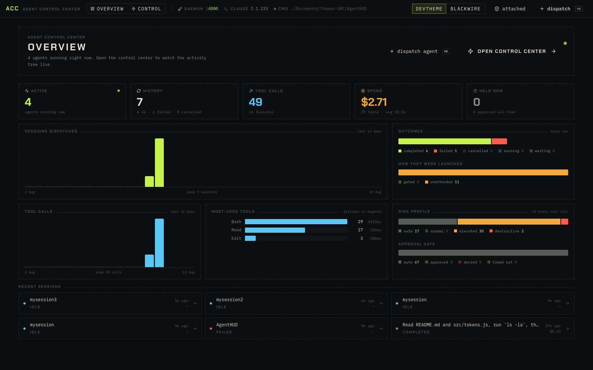
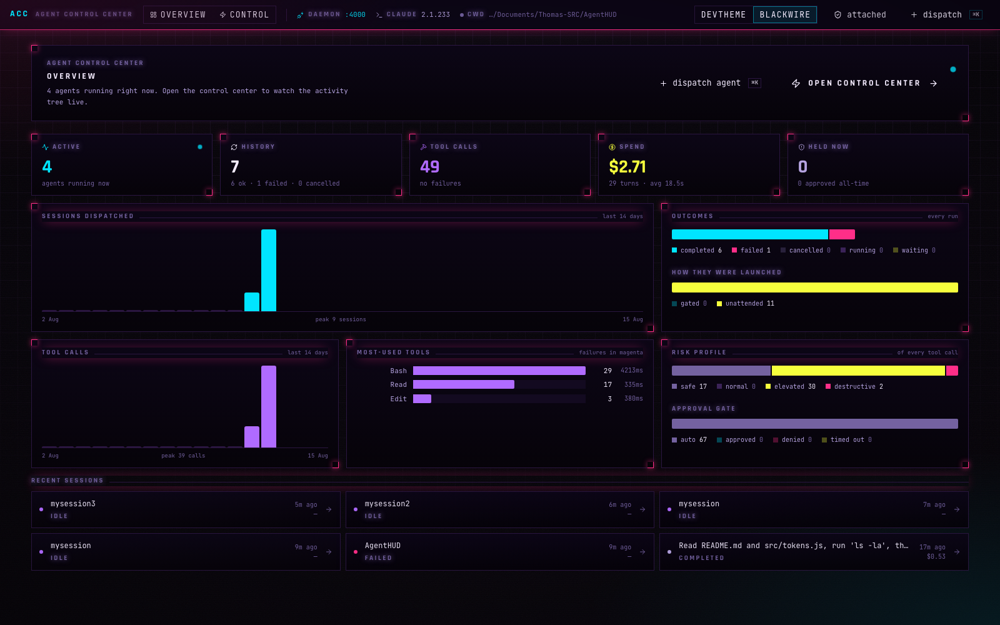
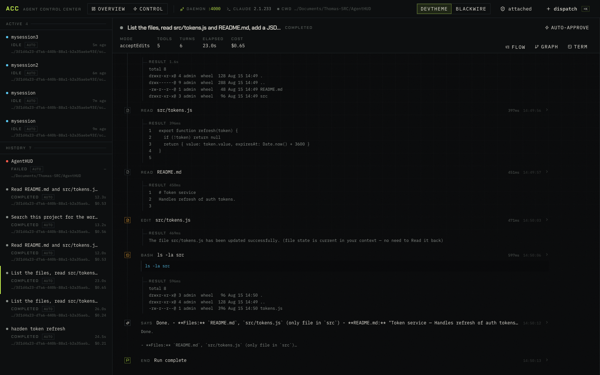
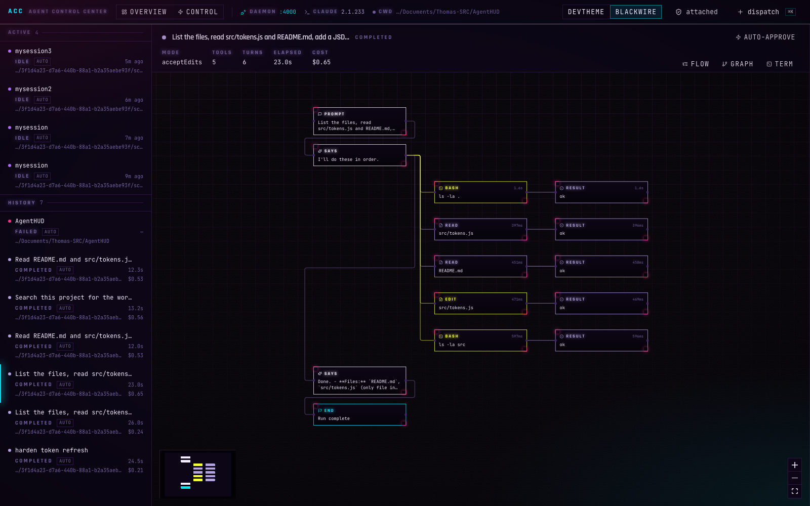
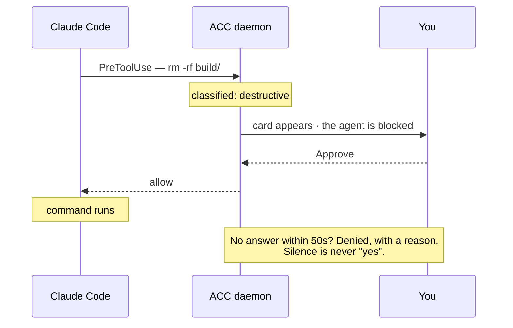
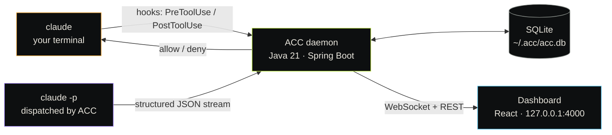

<div align="center">

# Agent Control Center

### Do you actually know what your agent is doing?

Claude Code scrolls past faster than you can read it. Files get written, commands
get run, and by the time you look up the terminal has moved on.

**ACC is a local flight recorder and control panel for Claude Code.** Every plan,
tool call, diff and result — as a live tree you can actually read, with a gate
that can stop a dangerous command *before* it runs.

[](LICENSE)
[](https://github.com/NexusLayerEU/AgentControlCenter/releases)
[](https://adoptium.net)
[](INSTALL.md)
[](INSTALL.md)

[**Install**](INSTALL.md) · [**Guide**](GUIDE.md) · [**Releases**](https://github.com/NexusLayerEU/AgentControlCenter/releases) · [**Changelog**](release/CHANGELOG.md)



</div>

---

## Why

You are running agents that write files and execute shell commands on your
machine. Three things are hard in a terminal:

|  | The problem |
|---|---|
| **You can't see it** | Output scrolls. Ten tool calls in, you have no idea what happened four steps ago. |
| **You can't stop it** | By the time you have read `rm -rf`, it has already run. |
| **You can't measure it** | How many sessions today? What did they cost? Which tool fails most often? |

ACC answers all three — locally, with no account and no telemetry.

---

## What you get

### An overview of everything your agents have done

Active runs, history, tool calls, spend, and what is blocked right now — plus
activity over time, run outcomes, the tools your agents actually reach for, and
the risk profile of every command they issue.



### A readable tree of a single run

Results nest under the call that produced them. Click any node for the full
input, the raw output, or a side-by-side diff of a file edit.



### The same run as a call graph

Turns down the left, the tools each one invoked branching right, results
terminating the chain. Edges march while a call is still in flight.



### A gate that can actually stop a command



### Two themes

**DevTheme** — a warm-black instrument panel. **Blackwire** — cyberpunk, CRT
scanlines and neon. Switch from the top bar; the choice sticks.

---

## Quick start

```bash
# 1. Grab the bundle for your platform from Releases — no Java required
tar -xzf acc-0.2.0-macos-aarch64.tar.gz && cd acc-0.2.0

# 2. Install (user-level, no sudo)
./install.sh

# 3. Run
acc start      # dashboard on http://127.0.0.1:4000
acc attach     # start recording your own Claude Code sessions
acc open
```

Detailed instructions: [INSTALL.md](INSTALL.md).
How to actually use it: [GUIDE.md](GUIDE.md).

---

## How it works

ACC watches Claude Code two different ways, because the two kinds of session
expose different data.



**Sessions ACC dispatches** run with `--output-format stream-json`, so it sees
everything: the agent's prose, its thinking, every tool call and every result.

**Sessions you run yourself** are picked up through Claude Code's hooks. ACC pairs
`PreToolUse` and `PostToolUse` by `tool_use_id` into the same tree — everything
except the assistant's prose, which hooks do not carry.

### Decisions worth knowing

**A dead daemon never blocks your agent.** If the hook cannot reach ACC it exits 0
and the tool proceeds. Visibility must not become a single point of failure.

**Silence is never consent.** Claude Code kills a hook after its own timeout, so
ACC caps its wait below that and then **denies**, with an explicit reason.

**Your own sessions are never gated by default.** You are already answering Claude
Code's prompts in that terminal; a second gate in a browser tab you may not be
looking at would hang your work. Arm it per session if you want it.

**One click satisfies every retry.** Claude Code re-fires a blocked hook seconds
later with a fresh tool-use id. ACC keys approvals on session + tool + exact input,
so you are asked once — not three times.

---

## What it costs to leave running

Measured on an M1 Pro, not estimated:

| | |
|---|---|
| Memory | **~150 MB** resident |
| CPU, idle | **0.4%** of one core — about 6 cpu-minutes a day |
| CPU, during a run | **1.8%** of one core |
| Added per tool call | **~21 ms**, the same whether the daemon is up or down |

The daemon binds `127.0.0.1` only. No account, no cloud, no telemetry. Your
history lives in `~/.acc/acc.db` and nowhere else.

---

## Building from source

```bash
git clone https://github.com/NexusLayerEU/AgentControlCenter.git
cd AgentControlCenter
./acc build && ./acc start
```

Needs JDK 17+ (21 recommended), Node 18+, Maven, and Claude Code on your PATH.

```bash
cd backend && mvn test           # 69 tests
./release/build-release.sh       # all six distributable bundles
```

| Path | What |
|---|---|
| `backend/` | Spring Boot daemon — agent runner, hook bridge, approval gate, stats |
| `frontend/` | React dashboard — Vite, Tailwind v4, xterm.js, React Flow |
| `release/` | Packaging; bundles a Temurin JRE per platform |
| `acc` | Development control script |
| `docs/DEVELOPMENT.md` | Architecture and API reference |

---

## Contributing

Issues and pull requests welcome. Two house rules: comments explain **why**, never
what; and every behavioural rule gets a test.

## License

MIT — see [LICENSE](LICENSE).

<div align="center">
<sub>Built for people who would rather see what their agents are doing than find out afterwards.</sub>
</div>
